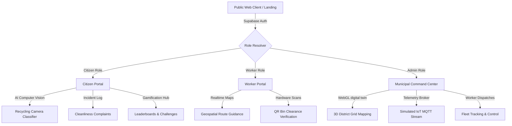

# 🌿 EcoTrack AI — Smart City Waste & Recycling OS (v1.0.0-RC)

> EcoTrack is a next-generation full-stack Smart City platform that transforms municipal waste management. By integrating interactive computer vision AI, real-time IoT sensors, decentralized route dispatch systems, and gamified citizen engagement loops, EcoTrack coordinates citizens, field workers, and municipal operators into a singular, highly cohesive ecological network.

---

## 🚀 Architectural Overview

EcoTrack is designed around three distinct, role-based, real-time operating portals, serviced by a unified cloud-native backend:



### Core Technologies

* **Frontend**: React 18+, TypeScript 5+, Vite (Bundler), Tailwind CSS.
* **Database & BaaS**: Supabase PostgreSQL, Row-Level Security (RLS), Realtime replication, Database Triggers.
* **State & Maps**: Leaflet Maps (Geospatial GIS), Recharts (Analytical reports), Motion (Fluid transitions).
* **Testing**: Vitest (Unit suite for calculation engine, scoring matrices, and mock fallbacks).

---

## 📂 Project Folder Structure

```
/
├── supabase/
│   └── migrations/
│       ├── 00001_create_all_tables.sql  # Database schemas and baseline triggers
│       └── 20260709000000_init_schema.sql  # Secure user schemas and initial seeds
├── src/
│   ├── main.tsx                         # Client application mounting file
│   ├── App.tsx                          # Primary React router & Auth State container
│   ├── types.ts                         # Universal type interfaces and TypeScript enums
│   ├── supabaseClient.ts                # Supabase instance initialization & offline caches
│   ├── supabaseService.ts               # Core DB services, GraphQL emulation, & fallbacks
│   ├── supabaseService.test.ts          # Mathematical scoring verification test suite
│   ├── pages/                           # Immersive view routers
│   │   ├── LandingPage.tsx              # Portal gateway, system summaries & login
│   │   ├── CitizenPortal.tsx            # Eco diagnostics, Gamification & Rewards
│   │   ├── WorkerPortal.tsx             # Operator task pipelines & active routing
│   │   ├── AdminPortal.tsx              # Digital Twin controls, fleets & telemetry
│   │   └── FAQContact.tsx               # Resident documentation & public resources
│   └── components/                      # High-Fidelity UI widgets
│       ├── AICameraScanner.tsx          # Real-time computer vision classifier
│       ├── CitizenJourney.tsx           # Multi-metric visual chart history
│       ├── CitizenAchievements.tsx      # Experience levels and challenges
│       ├── CitizenCommunity.tsx         # District activity feeds & leaderboards
│       ├── CitizenNotifications.tsx     # Real-time alert filter logs
│       ├── SmartBinMap.tsx              # Interactive map pinning and status updates
│       ├── EcoBot.tsx                   # Intelligent recycling chat advisor
│       └── smartcity/                   # Command Center visualizers
│           ├── DigitalTwin.tsx          # WebGL command deck coordinates representation
│           ├── DroneManagement.tsx      # Unmanned flight tracking & flight loops
│           └── IoTSensorsMQTT.tsx       # Live telemetry and data stream graphers
```

---

## 🛠️ Installation & Setup

Follow these simple steps to run EcoTrack on your local workstation:

### 1. Prerequisites
Ensure you have **Node.js v18+** and **npm** installed on your workstation.

### 2. Clone and Install Dependencies
```bash
# Clone the repository
git clone https://github.com/your-username/ecotrack.git
cd ecotrack

# Install all workspace dependencies
npm install
```

### 3. Setup Environment Variables
Create a `.env` file in the root folder using `.env.example` as a baseline:
```env
# Supabase project settings
VITE_SUPABASE_URL=https://your-project-id.supabase.co
VITE_SUPABASE_ANON_KEY=eyJhbGciOiJIUzI1NiIsInR5cCI6IkpXVCJ9...

# Optional: Cloudinary configuration for scan images
VITE_CLOUDINARY_CLOUD_NAME=your_cloud_name
VITE_CLOUDINARY_UPLOAD_PRESET=your_preset
```

### 4. Apply Database Migrations
Deploy the secure schema directly into your Supabase Postgres database. You can copy the contents of `supabase/migrations/20260709000000_init_schema.sql` directly into the Supabase SQL Editor.

---

## 🖥️ Running the Application Locally

Start the local development server:
```bash
# Boot the Vite dev server (runs on Port 3000)
npm run dev
```

Run the unit test suite to verify calculation matrices:
```bash
# Execute Vitest suite
npm run test
```

Build and compress the application for production deployment:
```bash
# Compile and output static bundle into dist/
npm run build
```

---

## 🚀 Production Deployment

### Frontend (Vercel)
1. Fork or push this repository to GitHub.
2. Link your repository inside your Vercel Dashboard.
3. Configure your Environment Variables (`VITE_SUPABASE_URL` and `VITE_SUPABASE_ANON_KEY`).
4. Click **Deploy**. Vercel will build the React bundle and serve it on a secure edge network.

### Backend & Database (Supabase)
* Enforce **Row-Level Security (RLS)** policies defined in `20260709000000_init_schema.sql`.
* Set up a dedicated bucket `scan-images` with public viewing access enabled.
* Set up edge routing for push notification alerts.

---

## 🗺️ Roadmap & Future Vision

* **IoT Smart Bin Integration**: Connect actual hardware micro-controllers using secure MQTT endpoints.
* **Offline Routing**: Enable advanced service workers to map routing data while in cellular dead-zones.
* **Direct Reward Exchanges**: Enable automated local merchant integrations for real-time coupon scanning.
* **Edge ML Classifications**: Migrate the AI computer vision waste classifier directly to WebGL client edge containers.

---

## 📄 License
This project is licensed under the MIT License - see the `LICENSE` file for details.

---

## 🙌 Credits
Designed and engineered with care by the EcoTrack Smart Cities core team. Special thanks to local municipal operators, neighborhood groups, and waste classification engineers.
